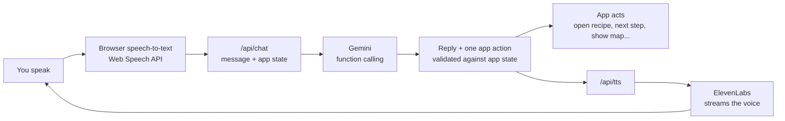

# Sous

**A voice-first AI sous chef.** Talk to Sous while you cook. It looks in your fridge, suggests recipes from what you have, walks you through every step hands-free, and keeps a nutrition diary of what you eat.

Built in 24 hours at **StormHacks 2026**, for MLH **Best Use of Gemini API** and **Best Use of ElevenLabs**.


---

## Contents

- [Why Sous](#why-sous)
- [Features](#features)
- [How it works](#how-it-works)
- [Tech stack](#tech-stack)
- [Getting started](#getting-started)
- [Configuration](#configuration)
- [API reference](#api-reference)
- [Project structure](#project-structure)
- [Reliability](#reliability)
- [Demo script](#demo-script)
- [Credits](#credits)

---

## Why Sous

You get home tired and hungry, open the fridge, and have no idea what to make. Then you're scrolling a recipe with messy hands and losing your place. Nutrition apps don't help either: logging food feels like homework.

Sous is a sous chef you just talk to. It acts inside the app for you (opening screens, moving through steps, playing videos, logging meals), so you never have to put the knife down.

## Features

### Talk to a chef
- **Four personas**, each a mascot with its own ElevenLabs voice and personality: Maya (warm), Leo (calm, the default), Nova (upbeat) and Brock (a protein-minded coach).
- **Hands-free conversation.** Once a call starts, Sous keeps listening. Your turn ends after a 1.5-second pause.
- **Interrupt naturally.** Talk over Sous to cut it off; its own voice is filtered out so it doesn't interrupt itself.
- **Voice control of the mic.** "Stop listening" puts Sous to sleep; "start listening" or "hey Leo" wakes it.
- **Minimize the call** and keep using the app; Sous waits in a floating bubble.

### Cook
- **Fridge scan:** snap a photo and Gemini lists your ingredients as editable chips.
- **Recipe matching:** a curated catalog plus live recipes from TheMealDB, ranked by how much of your fridge they use.
- **Step-by-step cooking mode:** spoken steps, timers, "next", "go back", "go to step five", and any cooking question ("can I use olive oil instead of butter?").
- **In-app recipe videos** that start at the current step. Gemini watched each catalog video to find where every step begins.
- **Groceries:** what you're missing, two nearby stores with price estimates, and an in-app map with directions.

### Track
- **Snap your plate** or just say "I had a chicken wrap and a latte". Gemini estimates calories, macros, vitamins and minerals.
- **Daily diary** of 15 nutrients against your goals, a month calendar with your logging streak, and weekly highlights with tips.
- **Social feed** to share dishes, moderated by Gemini (no calories are ever shown publicly).

## How it works

The browser never calls an AI service directly. It talks only to our own Next.js API routes, which hold the keys.



1. **Speech in.** The browser's Web Speech API turns your voice into text. Short exact commands ("next", "open map", "show video") are handled locally with no network round trip.
2. **Context.** Everything else goes to `/api/chat` with a snapshot of the app: fridge ingredients, recipes on screen, the open recipe and step, the shopping list, nearby stores and today's diary.
3. **Decision.** Gemini answers with function calling: one of **14 app actions** (open the fridge camera, start cooking, go to step N, show groceries, open the map, play the video, log food, search recipes, and more) plus a short spoken line. The server validates every call against the app state, so Gemini can't invent a recipe or switch to a recipe you didn't name.
4. **Action and voice.** The app performs the action, and `/api/tts` streams the reply in the persona's ElevenLabs voice. In hands-free mode the mic reopens when Sous finishes speaking.

The other routes follow the same pattern: photos go to Gemini vision for structured JSON (fridge ingredients, plate nutrition), recipes come from the catalog plus TheMealDB, and posts are moderated before they're shared.

## Tech stack

| Layer | Technology |
| --- | --- |
| Framework | Next.js 16 (App Router, Turbopack), React 19, TypeScript (strict) |
| Styling | Tailwind CSS 4, design tokens from Figma, Motion for animation |
| State | Zustand, persisted to `localStorage` (no database, no accounts) |
| AI | Google Gemini via `@google/genai`: function calling, vision, structured JSON output |
| Voice out | ElevenLabs text-to-speech, `eleven_flash_v2_5` streaming, persona greetings pre-recorded with `eleven_v4` |
| Voice in | Web Speech API (browser built-in), with a typing fallback |
| Recipes | Curated catalog in Spoonacular format + TheMealDB (free, no key) |
| Media | YouTube privacy-enhanced embeds, Google Maps embed |
| Design | Figma (every screen and all four mascots) |

## Getting started

Requires **Node.js 20.9 or newer**.

```bash
git clone https://github.com/huangallan36/Hackathon-Meal-prep-.git
cd Hackathon-Meal-prep-
npm install
cp .env.example .env.local   # then add your keys
npm run dev                  # http://localhost:3000
```

The app runs with no keys at all, falling back to built-in answers, the bundled catalog and the browser's voice. Keys make it smart.

For the best experience use **desktop Chrome** (or Safari on iPhone), allow the microphone, and turn the sound on. Phones need HTTPS for the mic, so test on a phone through a deployed URL.

### Useful scripts

| Command | What it does |
| --- | --- |
| `npm run dev` | Start the dev server |
| `npm run build` / `npm start` | Production build and server |
| `npm run lint` | ESLint |
| `npm run voices` | Re-record the persona greetings with ElevenLabs |
| `npm run video-steps` | Have Gemini find where each step starts in the recipe videos |
| `npm run seed` | Replace the catalog with live Spoonacular recipes (needs a key) |

## Configuration

All variables are read on the server only. **Never prefix them with `NEXT_PUBLIC_`.** `.env.local` is git-ignored.

| Variable | Required | Purpose |
| --- | --- | --- |
| `GEMINI_API_KEY` | For AI features | Chat, vision, nutrition estimates, moderation ([get a key](https://aistudio.google.com/apikey)) |
| `ELEVENLABS_API_KEY` | For premium voices | Text-to-speech ([get a key](https://elevenlabs.io/app/settings/api-keys); needs Text to Speech and Voices read) |
| `SPOONACULAR_API_KEY` | Optional | Live Spoonacular recipes; TheMealDB is used without it |
| `GEMINI_CHAT_MODEL` | No | Model to try first for chat (falls back through a chain) |
| `GEMINI_VISION_MODEL` | No | Model to try first for vision |
| `ELEVENLABS_MODEL_ID` | No | TTS model (default `eleven_flash_v2_5`) |
| `ELEVENLABS_DEFAULT_VOICE_ID` | No | Voice before a persona is picked (default: Leo) |
| `SOUS_FORCE_CACHE` | No | `1` never calls Spoonacular |

### Deploy to Vercel

1. Import the repository in Vercel and keep the detected Next.js settings.
2. Add `GEMINI_API_KEY` and `ELEVENLABS_API_KEY` under **Settings → Environment Variables**.
3. Deploy.

## API reference

Every route runs on the Node.js runtime, validates its input, never logs keys or images, and returns a usable fallback instead of a bare error.

| Route | Purpose | Fallback |
| --- | --- | --- |
| `POST /api/chat` | One conversation turn: spoken reply + at most one app action | Local intent router |
| `POST /api/tts` | Streams ElevenLabs audio | Browser `speechSynthesis` |
| `GET /api/voices` | Available ElevenLabs voices | Static voice list |
| `POST /api/vision/ingredients` | Fridge photo → ingredient list | Sample ingredients |
| `POST /api/vision/meal` | Plate photo → dish and nutrition | Recipe's nutrition, or a generic plate |
| `POST /api/nutrition/estimate` | "Chicken wrap and a latte" → per-food nutrition | Built-in food table |
| `GET /api/recipes/by-ingredients` | Recipes ranked by fridge match | Bundled catalog |
| `GET /api/recipes/search` | Planner search | Bundled catalog |
| `GET /api/recipes/[id]` | One recipe (catalog, TheMealDB or Spoonacular) | 404 JSON |
| `POST /api/moderate` | Checks a social post's photo and caption | Local caption rules |

## Project structure

```
app/                 Screens (App Router) and API routes (app/api)
components/          UI by feature: voice, cooking, kitchen, planner, diary, me, mascot, ui
lib/
  voice/             Voice engine: speech in/out, hands-free loop, actions, chat context
  server/            Server-only code: Gemini, ElevenLabs, TheMealDB, chat prompt and validation
  recipes/           Catalog and recipe normalization
  stores/            Zustand stores (prefs, voice, kitchen, diary, social, video, map)
  intents.ts         Local command router (instant commands and offline answers)
data/                Recipe catalog, YouTube ids, video step timestamps
public/              Mascots, voice greetings, recipe and store photos, Figma assets
scripts/             Voice recording, video timestamps, catalog seeding
```

## Reliability

A live demo can't depend on perfect wifi or API quotas, so every layer degrades gracefully:

- **Gemini:** each call walks a chain of models with per-attempt timeouts. If all fail, a local intent router still handles the main commands.
- **ElevenLabs:** if it's slow or unavailable, the browser's built-in voice speaks instead.
- **Recipes:** the curated catalog always works; live sources add to it when they respond.
- **Speech input:** if the microphone is blocked or unsupported, you can type to Sous instead.
- **Nutrition:** AI numbers are labelled as estimates, and photo estimates can be edited before they are logged.

## Demo script

About three minutes. Desktop Chrome, sound on, mic allowed. Start by tapping **Settings** on Home, then **Reset demo data**.

1. Pick a chef, then **Start talking**: *"I'm wiped, no idea what to cook."* Sous opens the fridge camera.
2. **Use sample photo**, then **Find recipes**. Say *"let's do the first one."*
3. Sous lists the ingredients. Say *"yeah, let's cook."*
4. Cook hands-free: *"next"*, *"go to step four"*, *"can I use olive oil instead of butter?"*, *"show video"*.
5. *"Where can I get groceries?"*, then *"open map"*.
6. Finish, snap the plate, and **Log to diary**. Then: *"Log my lunch, chicken wrap and a latte."*
7. Open the **Diary** to see today's nutrients against your goals.

## Credits

- **Design:** the team's Figma file *Stormhacks 2026 (Updated)*, including the four mascots.
- **AI:** [Google Gemini](https://ai.google.dev). **Voice:** [ElevenLabs](https://elevenlabs.io).
- **Recipes:** each catalog dish links its source recipe; live recipes and photos from [TheMealDB](https://www.themealdb.com).
- **Photos:** dish, ingredient and store photos from [Wikimedia Commons](https://commons.wikimedia.org), and the sample fridge photo from [Unsplash](https://unsplash.com/photos/AEU9UZstCfs). Full list in [`public/CREDITS.md`](public/CREDITS.md).
- **Avatars:** [DiceBear](https://www.dicebear.com) Notionists, CC0.
- **Fonts:** Bricolage Grotesque and DM Sans (SIL Open Font License). **Icons:** [Lucide](https://lucide.dev).
- **Development:** built with [Claude Code](https://claude.com/claude-code) as an AI coding assistant, directed and tested by the team.
